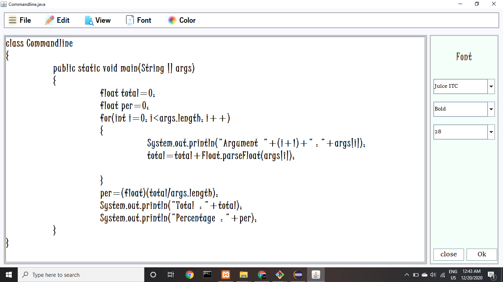
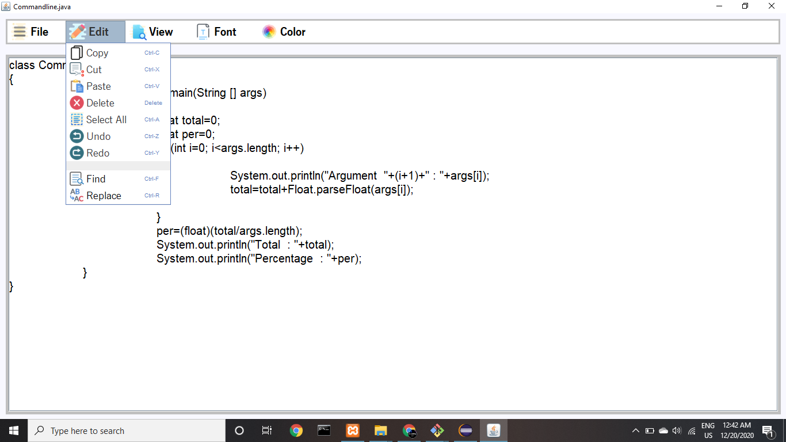
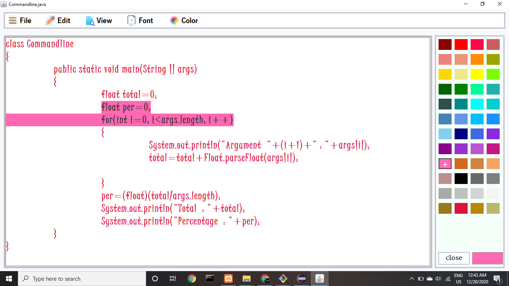
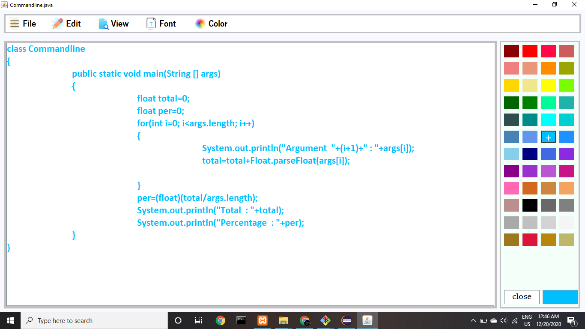

# Text Editor in java swing

### Hi there ...!
In this project I've created Text-Editor using Java-swing.

# Features
 
* Create file
* Save file
* Open file
* Change text color
* Change selection color
* Print file
* Change font style and size
* Cut-Copy-Paste
* Undo-Redo
* Find word
* Replace word

# Youtube Demo

# Screenshots

# Created by

[Ajaysinh Rathod](https://github.com/Ajaysinh1290)

Email : ajaysinhrathod1290@gmail.com

# Social Media Accounts
&nbsp; &nbsp; &nbsp; &nbsp; &nbsp;
&nbsp; &nbsp; &nbsp; &nbsp; &nbsp; 
&nbsp; &nbsp; &nbsp; &nbsp; &nbsp; 

